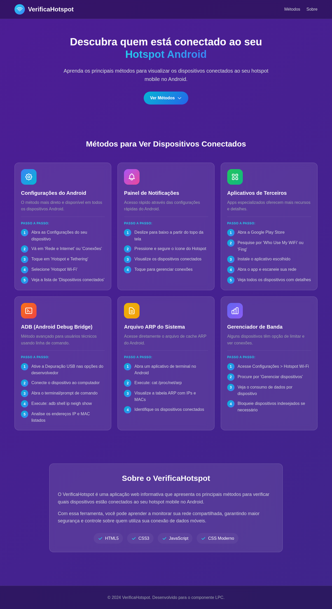

# VerificaHotspot

Aplicativo Web desenvolvido com HTML, CSS e JavaScript para ver os principais métodos de visualizar os dispositivos conectados no seu hotspot mobile no Android.

## 🚀 Tecnologias Utilizadas

- **HTML5** - Estrutura da aplicação
- **CSS3** - Estilização customizada com design moderno
- **JavaScript** - Funcionalidades interativas

## 📱 Funcionalidades

O VerificaHotspot apresenta 6 métodos diferentes para verificar dispositivos conectados ao seu hotspot:

1. **Configurações do Android** - Método nativo do sistema
2. **Painel de Notificações** - Acesso rápido via configurações rápidas
3. **Aplicativos de Terceiros** - Apps como Fing e Who Use My WiFi
4. **ADB (Android Debug Bridge)** - Método avançado via linha de comando
5. **Arquivo ARP do Sistema** - Acesso direto ao cache ARP
6. **Gerenciador de Banda** - Controle de dispositivos e consumo

## 🔧 Como Usar

1. Clone o repositório:
```bash
git clone https://github.com/Otavio-Emanoel/VerificaHotspot.git
```

2. Abra o arquivo `index.html` no seu navegador

## 📂 Estrutura do Projeto

```
VerificaHotspot/
├── index.html      # Página principal
├── style.css       # Estilos customizados
├── script.js       # Lógica JavaScript
└── README.md       # Documentação
```

## 📸 Screenshot


## 📝 Licença

Desenvolvido para o componente LPC.
